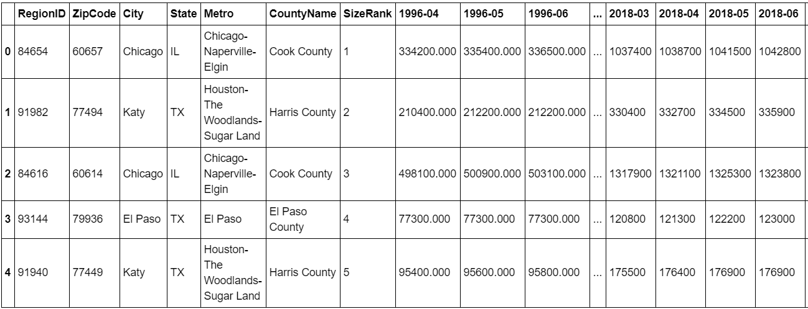
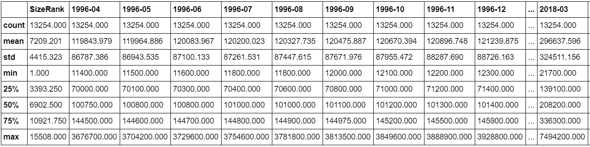
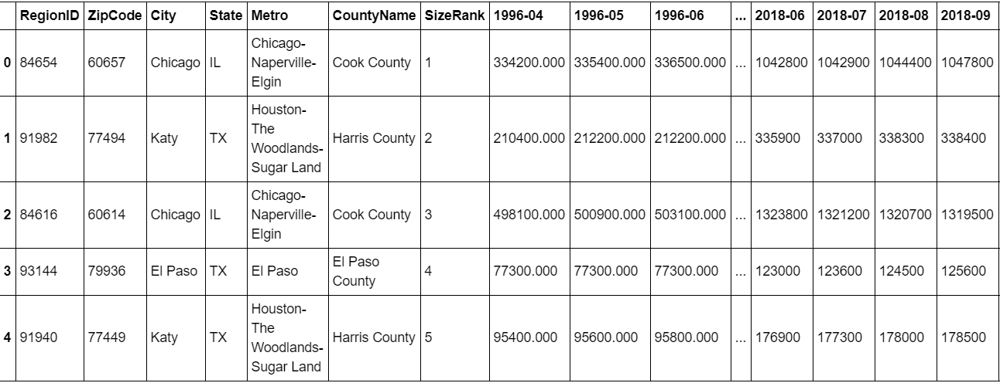
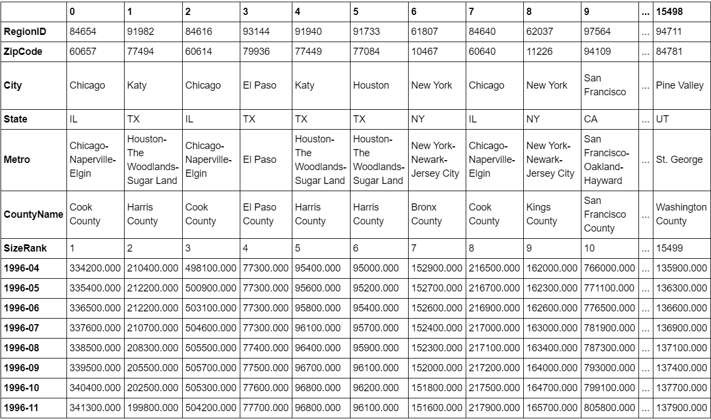
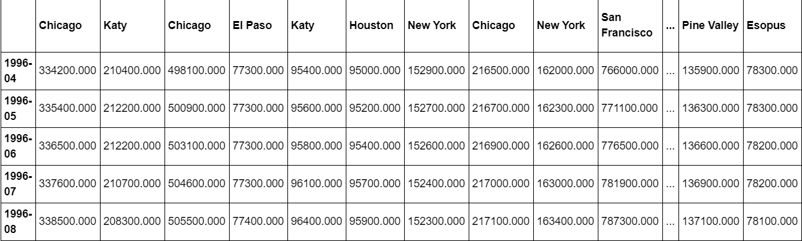
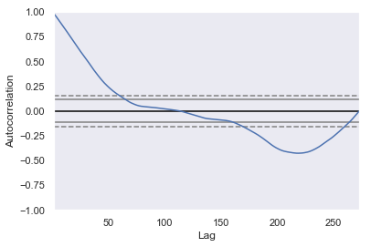
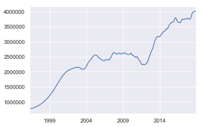
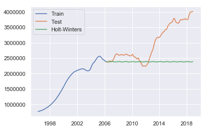
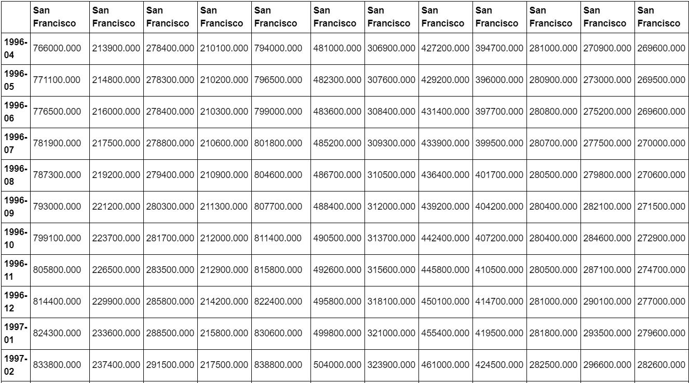
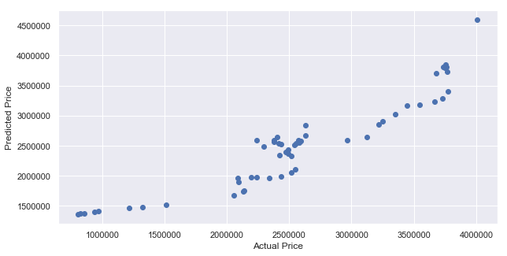

# Exploring Zillow--Real estate Dataset using Pandas

**Author**: SHAILESH DHAMA

### Business problem:

To employ time series forecasting on Zillow dataset.

### DATASET : https://github.com/ShaileshDhama/Exploring-Zillow--Real-Estate-Dataset-using-Pandas/blob/master/Zip_Zhvi_SingleFamilyResidence.csv

## STEPS :

    - Data preprocessing and cleaning
    - EDA(Exploratory Data Analysis)
    - Clustering on Size Rank and Price
    - Modeling
    - Time Series Forecasting
    - Regression Forecasting

## RESULTS :

#### Data Visualisation

> Contents of Dataset.


> Dataset description


> DataFrame cleaning


> Transposed DataFrame.


> Cities DataFrame.

#### Time-series plots:


> Autocorrelation plot.


> Simple Time-series plot.


> Time series forecast using Holt Winters.


> Regression Forecast


> Regression model predictions.

### For further information
Please review the narrative of our analysis in [our jupyter notebook](./1.Exploring%20Zillow%20DataSet-REAL%20ESTATE.ipynb)

For any additional questions, please contact **shaileshshettyd@gmail.com)

##### Repository Structure:

```
├── README.md                                                       <- The top-level README for reviewers of this project.
├── 1.Exploring Zillow DataSet-REAL ESTATE.ipynb                    <- narrative documentation of analysis in jupyter notebook
└── images                                                          <- both sourced externally and generated from code
```
